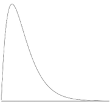

# Discussion topics part 1

## General statistics:
1. The chances of somebody dying on their birthday are 13% higher than on any other day. Is this possible? Explain.
1. What does the following graph say about the test of which it represents the scores?

    

1. The following graph tries to make the point that global warming is out of control. But what is wrong with it?

    

1. Under which conditions can a pie chart be used?
1. Explain the difference between “variation” and “covariation” with an example of our hypothetical student-grade-dataset.
1. What is the difference between a bar plot and a histogram? When do we use them?
1. How can you explore covariation? Are there different graphs that we can use?
1. Explain covariance and correlation with an example.

## Ethics in AI

1. Suppose we record all information on our students (gender, race, height, shoe size, schooling history, profession of parents, …) and use this to only allow students with a reasonable chance of succeeding to start in the first year. Would that be a good idea? Would it be an ethical idea?
(Good: something that works, that does what it is supposed to, Ethical: Being in accordance with the accepted principles of right and wrong that govern the conduct of a profession. E.g., robbing a bank is a good idea because it gets you a lot of money fast, but it isn’t an ethical idea because it is illegal and people may die.)
1. Suppose we record all school-related information on our students (class attendance, exam results, how long they studied, …) and compare this with the results of students finishing the first year, it would give us an insight in their chances of finishing our program in a timely fashion.
What if we forbid students that we think would not finish or take more than 4 years to continue in our program. Would that be a good/ethical idea?
What if we wouldn’t forbid them, but simply gave them a very strong warning (unless you dramatically change some of these parameters, you won’t be finishing this program according to the data). Would that be a good/ethical idea?

## Group forming

1. Let everyone in your group take a random personality test (Enneagram, Typefinder or MBTI, Big Five Assessment, Career Profiler, Workplace DISC Test, …). Compare these totally unrelated results.
1. Generate a couple of random roles using https://www.randomlists.com/random-jobs (you can rerun as much as necessary). Assign all team members a role with description of tasks.
1. The three of you start a company that specializes in data management. Think of a name. Write (or let some AI generate) a company introduction and mission statement.
1. Create a markdown file with your company information, a professional picture of every one of you along with your job title and tasks. Upload this in your github as “README.md” and post the link to the repo in the team chat you made that included the instructor.
