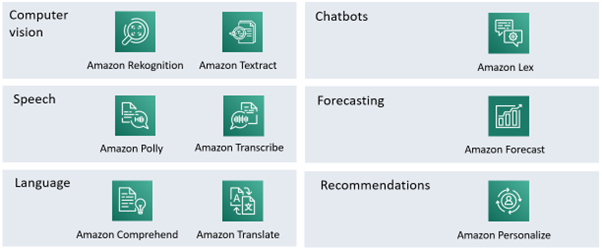

# Discussion topics part 2

## The AWS-lesson

1. Is it a good idea to be using Python and Jupyter notebooks? Are there any alternatives like Julia, R, Java, C#, …?
2. Amazon has some managed services that provide AI-services without the need for any real understanding of the technology involved. Will they preform better than a model that we can make ourselves? What are the [dis]advantages of using them?

    

3. Give an example of supervised and unsupervised learning when using a file with all data about students (grades, but also age, shoe size, family situation, …).
4. We have a file of student grades and how much they studied for a test. We want to predict their test scores. Explain the difference between binary classification, multi-label classification and regression in this context.
5. Can we use AI to do feature engineering? Is it regularly done this way?
6. Explain over- and underfitting in the context of multi-label classification.

## The powerpoint and exercises

1. The powerpoint states: "The model should generalize to unseen data if you are using it to predict. If it’s just to explain the data overfitting isn’t a problem." Explain!
1. To get rid of outliers, we simply look at the values and delete the row with the highest value for every column. Or is there a better way?
1. Why does the Z-score doesn't matter in a column that is used in one hot encoding?
1. What is scaling/normalization of data?

