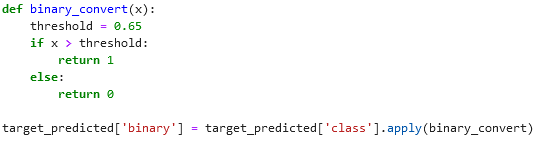

# Discussion topics part 3

## The AWS-lesson

1. You want to detect fraud in future transactions. You can work with 1.000.000 past transactions of which 2.53% is labeled as fraudulent. Which problem will you be facing?µ
1. Could I use an Amazon S3 bucket as a sort of google drive for my personal files?
1. Give some pros and cons for Amazon FSx.
1. Give some pros and cons for Amazon EFS.
1. What is Amazon RDS.
1. What is Amazon Redshift.
1. What would a usecase Amazon Timestream be?
1. What is the service that amazon uses to keep data safe - i.e. that not anybody can access it? (IAM)
1. What is CloudTrail?
1. Explain: feature selection, feature extraction and feature creation.
1. Why can't we just encode blue as 1 and red as 2? Then what should we do?
1. When doing feature selection, you might use wrapper methods or filter methods. What are the [dis]advantages of both?
1. Explain the different sets in which you split your data. (Train, test, validation.)
1. What is K-fold cross validation and when is it used?
1. Why do we need to randomize data before splitting it in different sets?
1. What is deploying a model? How do you go about it in AWS?
1. Draw and explain a basic confusion matrix.
1. Draw and explain a basic ROC-curve.
1. In the sagemaker labs, you see the function below. Why the 65%? Why not 50%?

## The powerpoint and exercises

1. What is the difference in the type of problems XGBoost and Random Forest can cope with?
1. Explain XGBoost.
1. Explain the linear learner we can find on AWS.
1. Explain the K-means algorithm we can find on AWS.
1. Explain the 3-set split in data sets.
1. "The validation data set as well as the testing set, should follow the same probability distribution as the training data set." Explain.
1. Draw a confusion matrix for a binary classifier, and another for a multiclass classifier.
1. Sensitivity and specificity: explain, and give an example for when they would be better high.
1. Explain thresholds in the context of sensitivity and specificity.
1. Describe the best and the worst possible models based on their ROC curves.
1. How would you calculate the AUC-ROC? How is it used?
