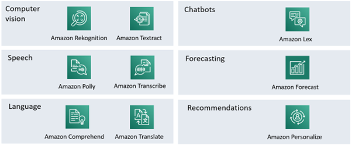
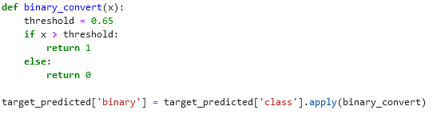

# When to do which AWS chapter?

* Week 1: Chapter 1 and 2 (introductions)
* Week 2: Chapter 3
    * Section 1: Nice to know
    * Section 2: Nice to know, but try to keep track of all the AWS-lingo
    * Section 3:
        * Need to know, but really “should already know”
        * Introduces pandas! (entire section should be very familiar)
        * Also talks about correlation, which will be a main topic later on here
    * Section 4:
        * Need to know
        * Dive deeper into pandas, but more on data than section 3
    * Section 5:
        * Need to know
    Section 6:
        * Need to know, but short
    Section 7:
        * Need to know
        * Confusion matrix and ROC-curves
        * A difficult section, take your time for it
    Section 8:
        * Nice to know, hyper parameter tuning only works if you know what you are tuning
        * You can’t make a car go faster by randomly screwing and unscrewing bolts in your engine
        * It’s not something you will learn in 7 slides
        * We will be covering this later
* Week 4: Chapter 4
    * Section 1: Nice to know
    * Section 2: Need to know
    * Section 3:
        * Using Amazon forecast, which does a lot of the work for you
        * Model accuracy
    * Section 4: Guided lab

# Discussion topics on the AWS-course

## Chapter 2

1. Is it a good idea to be using Python and Jupyter notebooks? Are there any alternatives like Julia, R, Java, C#, …?
2. Amazon has some managed services that provide AI-services without the need for any real understanding of the technology involved. Will they preform better than a model that we can make ourselves? What are the [dis]advantages of using them?

    

3. Give an example of supervised and unsupervised learning when using a file with all data about students (grades, but also age, shoe size, family situation, …).
4. We have a file of student grades and how much they studied for a test. We want to predict their test scores. Explain the difference between binary classification, multi-label classification and regression in this context.
5. Can we use AI to do feature engineering? Is it regularly done this way?
6. Explain over- and underfitting in the context of multi-label classification.

## Chapter 3

1. You want to detect fraud in future transactions. You can work with 1.000.000 past transactions of which 2.53% is labeled as fraudulent. Which problem will you be facing?
1. Could I use an Amazon S3 bucket as a sort of google drive for my personal files?
1. Give some pros and cons for Amazon FSx.
1. Give some pros and cons for Amazon EFS.
1. What is Amazon RDS?
1. What is Amazon Redshift?
1. What would a usecase for Amazon Timestream be?
1. What is the service that amazon uses to keep data safe - i.e. that not anybody can access it? (IAM)
1. What is CloudTrail?
1. Explain: feature selection, feature extraction and feature creation.
1. Why can't we just encode blue as 1 and red as 2? Then what should we do?
1. When doing feature selection, you might use wrapper methods or filter methods. What are the [dis]advantages of both?
1. Explain the different sets in which you split your data. (Train, test, validation.)
1. What is K-fold cross validation and when is it used?
1. Why do we need to randomize data before splitting it in different sets?
1. What is deploying a model? How do you go about it in AWS?
1. Draw and explain a basic confusion matrix.
1. Draw and explain a basic ROC-curve.
1. In the sagemaker labs, you see the function below. Why the 65%? Why not 50%?

## Chapter 4

1. What is the difference between univariate and multivariate data?
1. What is the difference between cyclical and seasonal data?
1. Time series data tends to be correlated. What does this mean?
1. What data augmentation would have been useful in the bike-highway data? (The exercise on grouping data, 2.4)
1. What meta data would have been useful in the bike-highway data? (The exercise on grouping data, 2.4)
1. There are four ways of filling in missing data in time-series data (Forward fill, backward fill, moving average an interpolation). Explain them with an example.
1. What is the lookahead risk when using backward fill?
1. What is the big problem with an out of stock-problem?
1. What is downsampling? And when is it a good idea?
1. What is smoothing in the context of outliers in time series data? Why are we handling outliers differently in time series data?
1. Explain seasonality in time series with an example.
1. When selecting a predictor in AWS forecaster you need to select a domain. Explain and give some examples.
1. When predicting your data can include the time series, metadata and related. Explain with an example. Which are required and which are optional?
1. Explain what a backtest windows is, and how it relates to the test and training-set split.
1. What are prediction quantiles?
1. When would you use the P10 quantile? And the P50? And P90?