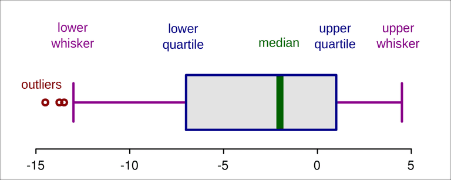

# Outliers

In data science, outliers refer to observations or data points that significantly deviate from the rest of the data. They are extreme values that are distinctively different from the majority of the dataset. Outliers can arise due to various reasons such as measurement errors, data corruption, or genuinely unusual observations in the underlying phenomenon being studied.

Outliers can have a significant impact on data analysis and statistical modeling. They can distort the results of statistical analyses, leading to incorrect conclusions or misleading interpretations. Therefore, it is important to identify and handle outliers appropriately in data science tasks.


## Identification

Outliers can be identified using various techniques. Some common methods include visual inspection of data through scatter plots or __box plots__, statistical methods such as z-score or modified z-score, or using machine learning algorithms specifically designed for outlier detection, such as isolation forests or robust covariance estimation.



## Impact

Outliers can have different impacts depending on the specific analysis being performed. They can affect summary statistics such as mean and standard deviation, leading to biased estimates. Outliers can also influence regression models by pulling the fitted line towards them or significantly affecting the coefficients. Therefore, it is crucial to understand the context and domain knowledge to determine the appropriate treatment for outliers.

## Handling

There are several approaches to handle outliers, and the choice depends on the nature of the data and the goals of the analysis. Some common strategies include:

* Removing outliers: If outliers are due to data entry errors or measurement issues, it may be appropriate to remove them from the dataset. However, this should be done cautiously, as removing genuine outliers can lead to loss of valuable information. This is by far the easiest solution to them.

The following methods are provided for your general information:

* Transformation: Transforming the data using mathematical functions (e.g., logarithm, square root) can help mitigate the impact of outliers by reducing their relative influence.
* Winsorization or clipping: This method involves capping the extreme values at a predefined threshold. Values above or below the threshold are replaced with the nearest valid value within the threshold.
* Robust statistics: Using robust statistical measures that are less affected by outliers, such as median instead of mean or interquartile range instead of standard deviation.
* Creating separate models: In some cases, outliers represent a distinct subset of data that requires separate modeling or analysis. Creating separate models or treating outliers as a separate category can be an appropriate approach.

## Domain knowledge

Understanding the domain and the underlying process that generated the data is crucial in determining how to handle outliers. In some cases, outliers may represent rare but valid observations that carry important insights or provide valuable information about the phenomenon being studied. (For example: the person who paid most on the titanic paid a lot more, but it's valid data. Other example: in a dataset of greenhouse temperatures, one cell gave a constant temperature of 254 degrees Celsius. This is because a rat ate the cable of that sensor. That is not valid data.)

It's important to note that the treatment of outliers should be guided by the specific context and goals of the analysis. There is no one-size-fits-all solution, and the appropriate approach to handling outliers may vary depending on the dataset and the problem at hand.

# Ordinal and nominal

Categorical data is a type of data that represents distinct groups or categories. It is used to classify and label data based on certain characteristics or attributes. Categorical data is often qualitative in nature and does not have a numerical value or measurement associated with it.

Categorical data can be further divided into two main subtypes: nominal and ordinal, as explained below. Nominal data represents categories that do not have an inherent order or ranking, while ordinal data represents categories with a specific order or hierarchy.

Examples of categorical data include:

1. Gender: Categorized as male or female.
2. Marital Status: Categorized as single, married, divorced, widowed, etc.
3. Educational Level: Categorized as high school, college, graduate degree, etc.
4. Hair Color: Categorized as black, brown, blonde, red, etc.
5. Vehicle Type: Categorized as car, truck, motorcycle, bicycle, etc.

It is important to note that categorical data cannot be subjected to numerical operations or calculations, such as addition or multiplication. However, various statistical techniques and methods exist to analyze categorical data, such as chi-square tests, contingency tables, and frequency distributions.

Ordinal and nominal are two different types of categorical data that are used to classify and categorize information. They are used in various fields, such as statistics, data analysis, and research.

## Nominal Data
Nominal data represents categories or labels that do not have any inherent order or ranking. In this type of data, the categories are simply different from one another, with no numerical or logical relationship. For example, colors, gender, marital status, or types of fruit are nominal variables. Each category is distinct and does not have any relative position or hierarchy. Nominal data is typically represented using labels or names, and no mathematical operations can be performed on it. The only operations that can be applied to nominal data are counting and frequency calculations.

Example: A survey asking individuals to choose their favorite color (red, blue, green, yellow) would yield nominal data.

## Ordinal Data
Ordinal data, on the other hand, represents categories that have a natural order or ranking between them. The categories in ordinal data can be arranged in a meaningful order or sequence, indicating the relative magnitude or position of each category. However, the intervals between categories may not be uniform or measurable. Ordinal data is often collected through rating scales, questionnaires, or surveys with response options that have a specific order. Some examples of ordinal variables include ratings of satisfaction (e.g., very dissatisfied, dissatisfied, neutral, satisfied, very satisfied) or educational attainment levels (e.g., elementary, high school, bachelor's, master's, doctorate).

Example: A survey asking participants to rate their level of agreement on a scale of 1 to 5 (strongly disagree, disagree, neutral, agree, strongly agree) would yield ordinal data.

In summary, the main difference between nominal and ordinal data lies in the presence or absence of a natural ordering or hierarchy among the categories. Nominal data represents unordered categories, while ordinal data represents categories with a meaningful order or ranking.

## Using in pandas

[https://pandas.pydata.org/pandas-docs/stable/user_guide/categorical.html](https://pandas.pydata.org/pandas-docs/stable/user_guide/categorical.html)

(Or you could look at the diamonds exercise. It has a great example of ordinal, categorical data: the type of cut.)

## One hot encoding

One-hot encoding is a technique used to represent categorical variables as binary vectors. It is a process of transforming categorical data into a numerical format that can be more easily understood and processed by machine learning algorithms.

One-hot encoding creates a new binary feature for each unique category in a categorical variable. Each binary feature represents whether an observation belongs to a specific category or not. If an observation falls into a particular category, the corresponding binary feature is set to 1; otherwise, it is set to 0.

Here's an example to illustrate the concept of one-hot encoding:

Suppose we have a categorical variable called "Fruit" with three categories: Apple, Banana, and Orange. One-hot encoding would transform this variable into three binary features: "Apple," "Banana," and "Orange." If an observation represents an Apple, the "Apple" feature would be set to 1 and the "Banana" and "Orange" features would be set to 0.

Original Categorical Variable:
Fruit: Apple

One-Hot Encoded Variables:
Apple: 1
Banana: 0
Orange: 0

One-hot encoding is commonly used when working with machine learning algorithms, as many algorithms require numerical inputs. By converting categorical variables into numerical representations, it allows algorithms to process and understand the data. One-hot encoding helps avoid the issue of assigning numerical values to categorical variables that could introduce unintended relationships or order between the categories.

It's important to note that one-hot encoding increases the dimensionality of the data, which can impact computation and memory requirements. Additionally, if a categorical variable has a large number of categories, one-hot encoding may result in a high number of binary features, potentially leading to the "curse of dimensionality." In such cases, feature selection or other techniques may be employed to mitigate these challenges.

# Missing values

In every data there are missing values. Sometimes a lot of values are missing in a row, sometimes a lot in a column. First step is to find where they are.

For this you can use DataFrame.info() in pandas, it displays the number of non-null values: ([example](https://datascienceparichay.com/article/pandas-get-dataframe-summary-with-info/))

```Python
# get dataframe summary
df.info()
```

```
<class 'pandas.core.frame.DataFrame'>
RangeIndex: 4 entries, 0 to 3
Data columns (total 3 columns):
 #   Column      Non-Null Count  Dtype  
---  ------      --------------  -----  
 0   Name        4 non-null      object 
 1   Age         3 non-null      float64
 2   Department  3 non-null      object 
dtypes: float64(1), object(2)
memory usage: 224.0+ bytes
```

So suppose there are a lot of Na-values. Then what?

Handling missing values is an important step in preparing structured data for machine learning. Here are some common strategies for dealing with missing values:

## Remove rows or columns (amputation)

If the missing values are in a small number of rows or columns, you may choose to remove those rows or columns from the dataset. However, this approach should be used with caution as it can lead to a loss of valuable information.

## Imputation

Imputation involves replacing missing values with estimated or predicted values. There are various techniques for imputing missing values, including:
- Mean/Median/Mode Imputation: Replace missing values with the mean, median, or mode of the available values in the respective column.
- Regression Imputation: Use regression models to predict missing values based on other variables.
- K-Nearest Neighbors (KNN) Imputation: Replace missing values with the average of the values from the nearest neighbors in terms of other variables.
- Multiple Imputation: Generate multiple imputed datasets by estimating missing values using statistical models, and then analyze the results from each imputed dataset.

An example of a simple imputation can be found in "Scripts/2.3 - missing values.ipynb".

### Special value imputation
Sometimes, it may be appropriate to replace missing values with a specific value that represents their absence. For example, you can assign a distinct value such as "Unknown" or "None" to indicate missing values.

### Indicator variable
Create an additional binary indicator variable that represents the presence or absence of missing values. This way, the missingness information can be captured by the model and potentially provide useful insights.

### Advanced techniques:
There are more sophisticated techniques available for handling missing values, such as using machine learning algorithms specifically designed for missing data, like Expectation-Maximization (EM) algorithms or probabilistic graphical models. These methods can handle missing data in a more principled and integrated manner.

### SKlearn imputer

[This one](https://scikit-learn.org/stable/modules/generated/sklearn.impute.SimpleImputer.html)

## Summary

__The choice of strategy depends on the specific dataset, the amount and pattern of missing data, and the nature of the problem you are trying to solve. It is important to understand the reasons behind the missing values and consider the potential impact of each strategy on the integrity and interpretability of the data.__

Before applying any method, it is crucial to carefully analyze the missing data patterns, evaluate the assumptions of the imputation technique, and assess the potential impact on the downstream analysis or model performance.

(Example: in a dataset with student grades, I once replaced "passed" and "not passed" with 16 and 6 respectively. This allowed me to do calculations on this column, but it did give annoying spikes in my density graphs.)

# Bias

Bias refers to systematic errors or deviations from the true value or representation of a population in data collection, analysis, or decision-making processes. Several types of bias can arise in various contexts. Here are some common types of bias:

## Sampling Bias

Sampling bias occurs when the sample used in a study or analysis is not representative of the entire population of interest. This can happen due to factors such as non-random sampling, self-selection bias, or undercoverage. It leads to an overrepresentation or underrepresentation of certain groups or characteristics in the data, which can affect the generalizability of the findings.

## Selection Bias

Selection bias occurs when the selection of individuals, cases, or data points is influenced by factors that are related to the outcome being studied. It can occur in various forms, such as self-selection bias, non-response bias, or volunteer bias. Selection bias can lead to distorted or misleading conclusions and make it difficult to draw valid inferences about the population.

## Measurement Bias

Measurement bias occurs when there are errors or inaccuracies in the measurement or assessment of variables or outcomes. It can arise from various sources, including instrument bias, observer bias, social desirability bias, or recall bias. Measurement bias can lead to incorrect estimates or interpretations of relationships between variables.

## Reporting Bias

Reporting bias occurs when there is a systematic difference in the reporting of information or outcomes based on factors such as the nature of the results or publication bias. This can lead to a distortion of the overall evidence or literature available on a particular topic, as negative or non-significant results may be less likely to be reported or published.

## Confirmation Bias

Confirmation bias refers to the tendency to selectively search for, interpret, or recall information in a way that confirms preexisting beliefs, hypotheses, or expectations. It can lead to a skewed perception of evidence or the dismissal of contradictory information, potentially impacting decision-making or the objectivity of analysis.

## Bias in Algorithmic Decision-Making

In the context of machine learning and artificial intelligence, bias can arise when algorithms or models systematically discriminate against certain groups or individuals. This can happen if the training data used to develop the algorithm contains inherent biases or if the algorithm itself introduces biases in the decision-making process.

## Survivor bias

[youtube](https://www.youtube.com/watch?v=P9WFpVsRtQg)

## Snoop Bias

Snoop Bias occurs when information from the test dataset accidentally influences the training process, letting the model "cheat" by learning patterns it should not know in advance. This often leads to performance results that seem overly optimistic. However, these results are misleading—when the model encounters fresh, unseen data in practical applications, it stumbles because it has essentially memorized the test data it "snooped" on instead of learning to generalize.

**The Human Bias Risk:** Even before training begins, our own human tendency to recognize patterns can influence how we handle test datasets. For instance, we might unintentionally use knowledge from the test data while choosing features or selecting models. This seemingly harmless "peek" can skew the entire development process, resulting in a model that appears effective during testing but fails miserably in real-world applications. Therefore, it's crucial to keep the test set entirely off-limits until the final evaluation.

## Summary

It is important to be aware of these types of bias and take appropriate steps to minimize or mitigate their effects when collecting and analyzing data, conducting research, or developing algorithms. Strategies such as random sampling, rigorous study designs, careful measurement protocols, transparency in reporting, and regular bias assessments can help address and minimize bias.

# Scaling
Scaling involves transforming the data so that it fits within a specific range, typically 0 to 1 or -1 to 1. This is particularly important for algorithms that rely on distance calculations, such as k-nearest neighbors (KNN) or support vector machines (SVM). Common scaling methods include:

- **Min-Max Scaling**: Rescales the data to a fixed range, usually 0 to 1.
  $$ X_{\text{scaled}} = \frac{X - X_{\text{min}}}{X_{\text{max}} - X_{\text{min}}} $$
- **Standardization (Z-score Normalization)**: Centers the data around the mean with a standard deviation of 1.
  $$ X_{\text{standardized}} = \frac{X - \mu}{\sigma} $$
  where \( \mu \) is the mean and \( \sigma \) is the standard deviation.


