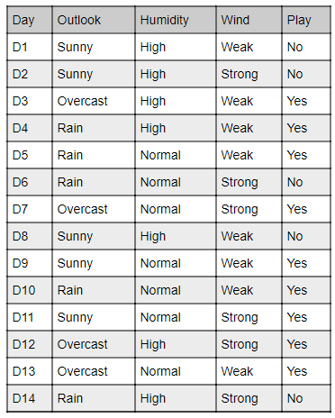
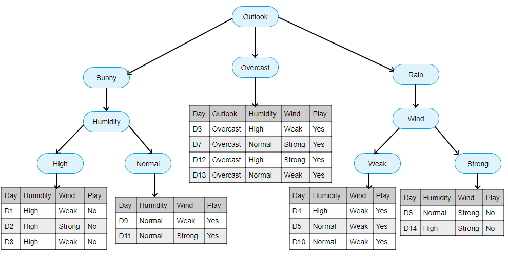

# XGBoost

XGBoost[2] (eXtreme Gradient Boosting) is an open-source software library which provides a regularizing gradient boosting framework. From the project description, it aims to provide a "Scalable, Portable and Distributed Gradient Boosting (GBM, GBRT, GBDT) Library". ([link](https://en.wikipedia.org/wiki/XGBoost))

But what is Gradient Boosting? Well, the story starts earlier, with decision trees.

| Feature / Algorithm          | **SVM**                            | **k-NN**                          | **Naive Bayes**                     |
| ---------------------------- | ---------------------------------- | --------------------------------- | ----------------------------------- |
| **Type**                     | Supervised, model-based            | Supervised, instance-based        | Supervised, probabilistic           |
| **Training Time**            | Medium to High                     | None (lazy learner)               | Very Fast                           |
| **Prediction Time**          | Fast (after training)              | Slow (especially with large data) | Very Fast                           |
| **Memory Usage**             | Low (stores model)                 | High (stores all training data)   | Low                                 |
| **Handles High Dimensions**  | Yes                                | No (curse of dimensionality)      | Yes                                 |
| **Interpretable?**           | Medium                             | Yes (examples are real data)      | Yes (probabilities, priors)         |
| **Assumptions**              | Margin-based, assumes separability | Similarity in space               | Feature independence                |
| **Sensitive to Outliers**    | Yes                                | Yes                               | Not very                            |
| **Handles Categorical Data** | No (needs encoding)                | Yes (with preprocessing)          | Yes (especially good with it)       |
| **Best Use Case**            | Clear margin between classes       | Low-dimension, simple problems    | Text classification, spam filtering |

## Decision trees

look at the following image:

Will John play tennis tomorrow? To decide we look at the forecast and compare the parameters (outlook, humidity, wind) to decide this. The structured way would be to ask a number of simple questions. But which questions?

This is a decision tree. For this data it allows us to accurately predict whether or not John will be playing tennis.

## Random forests

Decision trees are very simple, they are not flexible when it comes to classify new samples. Random Forests combine the simplicity of decision trees with flexibility resulting in a vast improvement in accuracy.

Watch the following video (from 0:25 till 9:27) to see how we can improve the accuracy of our predictions using a random forest.

[Link](https://www.youtube.com/embed/J4Wdy0Wc_xQ?start=24&end=567)

But we were working towards Gradient Boosting, not random forest.

## Gradient boosting

Gradient boosting is a machine learning technique used in regression and classification tasks, among others. It gives a prediction model in the form of an ensemble of weak prediction models, which are typically decision trees. When a decision tree is the weak learner, the resulting algorithm is called gradient-boosted trees; it usually outperforms random forest. A gradient-boosted trees model is built in a stage-wise fashion as in other boosting methods, but it generalizes the other methods by allowing optimization of an arbitrary differentiable loss function. ([link](https://en.wikipedia.org/wiki/Gradient_boosting))

There is one thing to note: Decision trees and random forest do classification, not regression. The classification can be binary or multiclass, but neither decision trees or random forest will ever tell you that they are 98.72482% shure that John will be playing tennis. Gradient boosting will, as the output is suited for not just classification, but also for regression.

But how does it work? Look at [this](https://www.youtube.com/watch?v=en2bmeB4QUo) video.

It has a lot of math, and difficult math at that (derivatives). What you need to know (or remember from your high-school math) is that a derivative or gradient (dutch: afgeleide) of a function gives you the direction in which that function goes on a certain point. You don't need to know or remember the math, but you should be able to explain that XGBoost combines weak learners (such as decision trees, but other models could be used) using a mathematical function to combine them in the best way possible.

## Comparison between random forests and boosting

Gradient Boosting and Random Forest are both ensemble learning methods, but they differ fundamentally in how they build and combine decision trees. Here's a breakdown of their key differences:

1. **Core Concept**

    * Random Forest: Uses a technique called bagging (Bootstrap Aggregating). It builds multiple decision trees independently using random subsets of data and features, and then combines their predictions (by averaging for regression or voting for classification).
    * Gradient Boosting: Uses boosting, where decision trees are built sequentially. Each new tree tries to correct the mistakes of the previous ones by focusing more on instances that were previously mispredicted.

2. **Training Process**

    * Random Forest:
        * Trains trees independently and simultaneously.
        * Each tree gets a random subset of training data (with replacement).
        * Reduces variance by averaging the predictions of multiple trees, making it less likely to overfit.
    * Gradient Boosting:
        * Trains trees in sequence, where each subsequent tree is trained on the residuals (errors) of the previous tree.
        * Each new tree helps minimize the loss function (e.g., mean squared error for regression) by focusing on correcting the mistakes of the ensemble so far.
        * Reduces bias but can be prone to overfitting if not tuned carefully (e.g., with regularization or early stopping).

3. **Combining Predictions**

    * Random Forest: Combines the predictions of all trees through averaging (regression) or majority voting (classification).
    * Gradient Boosting: Combines the predictions of trees by adding the weighted predictions of each tree to the previous ones, usually with a learning rate controlling how much each tree contributes.

4. **Complexity and Interpretability**

    * Random Forest: Easier to understand because it’s just an average of many decision trees. It’s generally less sensitive to hyperparameters.
    * Gradient Boosting: More complex due to sequential training and more hyperparameters (like learning rate, number of trees, and tree depth). It often requires more tuning but can achieve higher accuracy with the right settings.

5. **Performance Tuning**

    * Random Forest:
        * Key parameters include the number of trees, maximum depth, and the number of features considered at each split.
        * Less prone to overfitting as the trees are uncorrelated due to random subsets.
    * Gradient Boosting:
        * Requires tuning of learning rate, number of iterations (trees), and tree depth.
        * Overfitting is a concern, so it often needs regularization techniques (like shrinkage or sub-sampling).

### When to Use Which?

Random Forest is a good default when you want a robust and straightforward model, particularly for initial exploration or when interpretability is important.
Gradient Boosting is better suited when you need the highest possible predictive accuracy and are willing to invest time in hyperparameter tuning.

# Linear learner

The linear learner algorithm is an algorithm of which very little information can be found. It's can only be used in Amazon SageMaker, and on [this](https://docs.aws.amazon.com/sagemaker/latest/dg/ll_how-it-works.html) website we read that:

> With the linear learner algorithm, you train with a distributed implementation of stochastic gradient descent (SGD). You can control the optimization process by choosing the optimization algorithm. For example, you can choose to use Adam, AdaGrad, stochastic gradient descent, or other optimization algorithms. You also specify their hyperparameters, such as momentum, learning rate, and the learning rate schedule.

A stochastic gradient descent (often abbreviated SGD) is an iterative method for optimizing an objective function with suitable smoothness properties. It can be regarded as a stochastic approximation of gradient descent optimization, since it replaces the actual gradient (calculated from the entire data set) by an estimate thereof (calculated from a randomly selected subset of the data). Especially in high-dimensional optimization problems this reduces the very high computational burden, achieving faster iterations in exchange for a lower convergence rate. ([link](https://en.wikipedia.org/wiki/Stochastic_gradient_descent))

Summarized, it means that we are doing XGBoost, but estimating the gradients in stead of calculating them. Furthermore, AWS uses a distributed implementation, meaning it's no longer calculated on one system, but on many, thereby leveraging the power of AWS.

It can do classification (binary and multiclass) and regression.

Need more info? Check out [https://docs.aws.amazon.com/sagemaker/latest/dg/linear-learner.html](https://docs.aws.amazon.com/sagemaker/latest/dg/linear-learner.html), especially the sample notebooks.

# K-means

[The simple explanation.](https://www.youtube.com/watch?v=R2e3Ls9H_fc)

[Or something to read, perhaps?](https://towardsdatascience.com/k-means-a-complete-introduction-1702af9cd8c)

Notice anything different from the other two algorithms? We went from supervised to unsupervised. Before we said "we want to know if this is a bad back" or "we want to know how much this book would cost", but now we say "put these books in seperate piles" (not: "put these books in seperate piles based on their topic"), or "group these students".

If you're into the marketing-talk, definitely read [this](https://docs.aws.amazon.com/sagemaker/latest/dg/k-means.html). The sample notebook is really nice too.