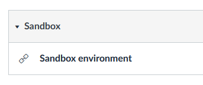

# The AWS-sample notebooks

When you open the AWS-canvas course, there is a link at the bottom to a sandbox environment. Open one!

__Problem! This is the first time we're using AWS, and it's not really obvious if students also have a sandbox. To work around this, open another lab and run the code there.__

__That's how it's documented here as well.__

We'll try to get an example running using XGBoost, linear learner and K-means.

* [XGBoost](https://sagemaker-examples.readthedocs.io/en/latest/introduction_to_amazon_algorithms/xgboost_abalone/xgboost_parquet_input_training.html)
* [Linear learner](https://sagemaker-examples.readthedocs.io/en/latest/introduction_to_applying_machine_learning/breast_cancer_prediction/Breast%20Cancer%20Prediction.html)
* [K-means](https://sagemaker-examples.readthedocs.io/en/latest/introduction_to_applying_machine_learning/US-census_population_segmentation_PCA_Kmeans/sagemaker-countycensusclustering.html)